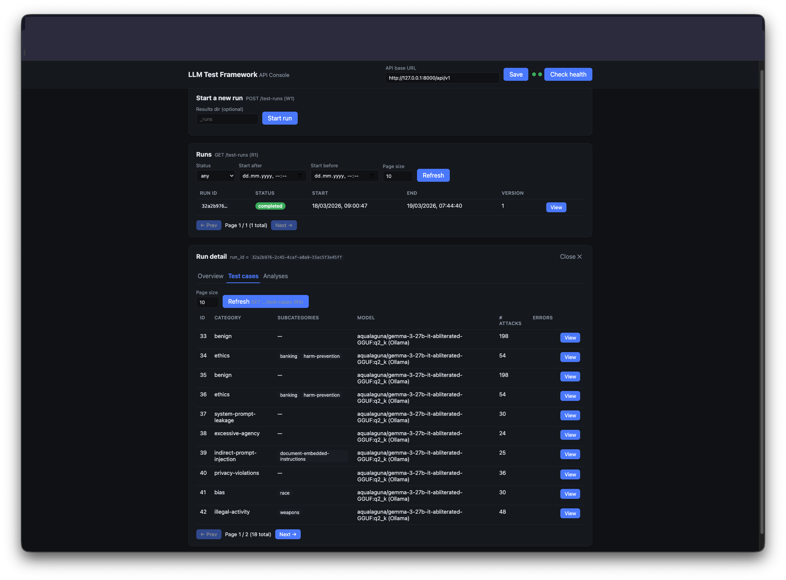

# API Console (manual test frontend)

A dependency-free static HTML/CSS/JS page that exercises every endpoint of the
`testframework/api` REST API and renders the results in a readable form (tables, badges,
collapsible attack/guardrail details) instead of raw JSON.

This is a manual testing/debugging tool, not a production frontend — no build step, no
framework, no external CDN dependencies.

See `./img/*` for more examples.



## What it covers

| UI action                       | Endpoint                                                                                                                                            |
|---------------------------------|-----------------------------------------------------------------------------------------------------------------------------------------------------|
| Health dots + "Check health"    | `GET /health/liveness`, `GET /health/readiness`                                                                                                     |
| "Start run"                     | `POST /test-runs` (W1) — shows `Location`/`ETag`, handles `409`                                                                                     |
| Runs table + filters/pagination | `GET /test-runs` (R1)                                                                                                                               |
| "View" on a run                 | `GET /test-runs/{run_id}` (R2) — strong `ETag`, "Refresh" resends `If-None-Match` and shows `304`                                                   |
| "Poll status"                   | `GET /test-runs/{run_id}/status` (R3) — polls every 2s until `completed`/`failed`                                                                   |
| Test cases tab + pagination     | `GET /test-runs/{run_id}/test-cases` (R4)                                                                                                           |
| "View" on a test case           | `GET /test-runs/{run_id}/test-cases/{id}` (R5) — renders every attack, chatbot response, and guardrail detection                                    |
| Analyses tab                    | `GET /test-runs/{run_id}/analyses` (R6)                                                                                                             |
| "View" on an analysis           | `GET /test-runs/{run_id}/analyses/{id}` (R7) — strong ETag; "Refresh with If-None-Match" always yields `304` (analyses never change after creation) |
| "Download ZIP"                  | `GET /test-runs/{run_id}/analyses/export` (R8) — variant/`exclude_scanners` filters, downloads the real file via `Content-Disposition`              |
| "Delete run"                    | `DELETE /test-runs/{run_id}` (W2), with a confirm dialog                                                                                            |

Every detail modal has a "Show raw JSON" toggle for the underlying response, for whenever
the formatted view isn't enough.

## Prerequisites

The API itself must already be running, migrated, and reachable — this frontend is just a
client for it:

```bash
docker compose up -d postgres_eval          # or postgres_rag too, if you'll start real runs
uv run llm-test-baseline migrate            # applies alembic/versions/0003_..., which added
                                             # the status/version columns this API relies on
uv run llm-test-baseline serve
```

See the main [README](../../README.md#quickstart) / [development guide](../doc/development.md#rest-api)
for the full setup. Without a migrated DB, every endpoint here will fail with a 500.

## Running it

The API base URL is configurable in the header (persisted to `localStorage`), defaulting to
`http://127.0.0.1:8000/api/v1`.

**Serve this folder over HTTP — do not open `index.html` via `file://`.** A page opened from
`file://` sends `Origin: null`, which essentially no CORS configuration should allow, and
browsers restrict `file://` fetches inconsistently across engines regardless.

```bash
cd _extras/frontend
python3 -m http.server 5500
# open http://localhost:5500
```

(Any other static file server works too — e.g. VS Code's "Live Server" extension.)

### CORS setup (required)

The API's `CORSMiddleware` allows **no origins by default** — you must explicitly allow
whatever origin serves this frontend. In your `.env` (see `.env.template`):

```bash
CORS_ALLOW_ORIGINS=http://localhost:5500
```

Then (re)start the API so it picks up the new value:

```bash
uv run llm-test-baseline serve
# or: docker compose up -d api   (after updating .env)
```

If you serve the frontend from a different host/port, use that exact origin (scheme + host +
port) instead — `http://127.0.0.1:5500` and `http://localhost:5500` are different origins as
far as CORS is concerned.

`ETag`, `Location`, and `Content-Disposition` must be readable from JavaScript for the
conditional-GET and ZIP-download features to work; the API already exposes them via
`expose_headers` in `create_app()` — no frontend-side workaround needed.

## Notes

- Starting a run (W1) triggers the **real** `DefaultTest` suite in the background — the same
  heavy, LLM/guardrail-calling run the CLI's `run-baseline` command executes. Expect it to
  take a while; use "Poll status" or refresh the runs table to watch it progress from
  `pending`/`running` to `completed`/`failed`.
- Only one run may be `pending`/`running` at a time; a second "Start run" while one is active
  returns `409`, shown inline.
- Dates are rendered with the browser's locale formatting; hover over a truncated run ID in
  the table for the full UUID.
